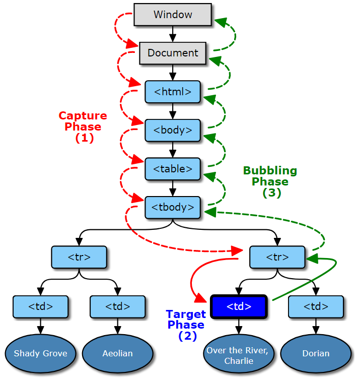

Event bubbling은 JavaScript를 사용해보면서 한 번쯤 들어봤을 수도 있는 용어이다. 이것은 어떤 엘리먼트가 다른 엘리먼트 안에 있고, 두 엘리먼트 모두 같은 이벤트에 대한 핸들러를 등록했을 때, 이벤트 핸들러가 호출되는 순서와 관련이 있다.

그러나 event bubbling은 퍼즐의 한 조각일 뿐이다. 이것은 종종 event capturing과 event propagation과 함께 언급된다. 그리고 이 세 용어를 잘 이해하고 있는 것은 JavaScript에서 이벤트를 잘 다루기 위해 필수적이다. - 예를 들어, event delegation pattern을 구현하고 싶을 때 말이다.

## Event Propagation

이벤트 전파는 양방향이다. window부터 이벤트 타겟까지 갔다가 다시 돌아온다. 이것은 세 단계로 나눌 수 있다.

1. window에서 이벤트 타겟의 부모까지: capture 단계
2. 이벤트 타겟 자신: target 단계
3. 이벤트 타겟의 부모부터 window까지: bubble 단계



### Event Capture 단계

이 단계에서는 capturer 리스너만 호출된다. 이것은 addEventListener의 세 번째 파라미터가 true로 등록된 리스너들이다.

```javascript
el.addEventListener('click', listener, true)
```

만약 이 파라미터가 생력되면, 이것의 기본 값은 false이므로 이 리스너는 호출되지 않는다.

### Event Target 단계 

이 단계에서는이벤트 타겟에 등록된 **모든 리스너**들이 호출된다. 캡쳐 플래그의 값은 상관없다.

### Event Bubbling 단계

Event bubbling 단계에서는 non-capturer들만이 호출된다. 이것은 addEventListener()의 세 번째 파라미터가 false로 등록된 리스너들이다.

```javascript
el.addEventListener('click', listener, false) // 리스너는 capture 되지 않는다
el.addEventListener('click', listener) // 리스너는 capturer 되지 않는다
```

모든 이벤트들에서 capture 단계는 모두 발생하지만, focus, blur, load를 비롯한 어떤 이벤트들은 bubbling되지 않는다. 바꿔말하면, 이벤트 전파가 target 단계 이후 멈춘다.

그래서 전파 종료 시 각각의 리스너는 딱 한 번만 호출된다.

Event bubbing은 모든 종류의 이벤트에 대해 발생하지 않는다. event 객체의 .bubbles 프로퍼티가 true인 리스너만 발생한다.

> event-ex01.html

## Propagation 정보에 접근하기

event 객체에는 다양한 프로퍼티들이 있다. 이 프로퍼티들을 통해 리스너에서 이벤트 전파에 관한 정보에 접근할 수 있다.

* e.target은 이벤트 타겟을 말한다.
* e.currentTarget은 실행되고 있는 리스너가 등록된 노드를 말한다. 리스너의 this 키워드로 가리키는 값인 실행 컨텍스트를 말한다.
* [e.eventPhase]로 현재 단계를 알 수 있다. Event 생성자의 상수 CAPTURING_PHASE, BUBBLING_PHASE, AT_TARGET 중 하나인 정수이다.

## 전파 막기

이벤트 리스너에서 이벤트 객체의 stopPropagation 메서드를 호출하면 이벤트 전파를 멈출 수 있다. current target의 이벤트 전파 경로 내 노드들에 등록된 모든 리스너가 불리지 않게 된다. 대신, current target에 등록된 나머지 리스너들은 이벤트를 전달 받는다.

```javascript
e.stopPropagation();
```

### 전파를 즉시 막기

이름에서 알 수 있듯이 stopImmediatePropagation은 전파를 곧바로 멈춥니다. 이 리스너의 다른 리스너들도 이벤트를 전달받을 수 없습니다.

```javascript
e.stopImmediatePropagation();
```

## 이벤트 취소

어떤 이벤트에는 브라우저가 이벤트 전파의 마지막에 실행하는 기본 동작이 있습니다.

예를 들어, 링크 엘리먼트를 클릭하면 브라우저가 새로운 페이지로 이동하는 것이 있습니다. 폼의 submit 버튼을 클릭하면 폼이 즉시 제출되는 것도 이에 해당합니다.

> event-ex02.html

## 참조

* [JavaScript의 이벤트 버블링이란? 이벤트 프로파게이션으로 설명해보자](https://github.com/cocopang/wiki/wiki/JavaScript%EC%9D%98-%EC%9D%B4%EB%B2%A4%ED%8A%B8-%EB%B2%84%EB%B8%94%EB%A7%81%EC%9D%B4%EB%9E%80%3F-%EC%9D%B4%EB%B2%A4%ED%8A%B8-%ED%94%84%EB%A1%9C%ED%8C%8C%EA%B2%8C%EC%9D%B4%EC%85%98%EC%9C%BC%EB%A1%9C-%EC%84%A4%EB%AA%85%ED%95%B4%EB%B3%B4%EC%9E%90)
* [What Is Event Bubbling in JavaScript? Event Propagation Explained](https://www.sitepoint.com/event-bubbling-javascript/)
* [Event reference](https://developer.mozilla.org/en-US/docs/Web/Events)