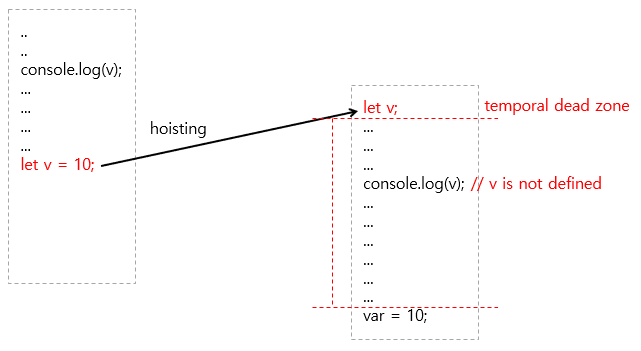

# var, let, const

ES6(ECMA Script 2015, 줄여서 ES6)로 넘어오면서 기존 ES5까지 사용하던 **변수 선언** 키워드인 var 외에 const와 let이라는 키워드가 추가 되었습니다.

## var

### 할당 및 선언

```javascript
var v;  // 선언
v = 10; // 할당

var x = 10; // 선언 + 할당
```

같은 이름의 변수를 중복 선언 가능합니다.

```javascript
var v = 1;
var v = 2;
console.log(v); // 2
```

선언보다 호출이 먼저 있었음에도 불구하고 이 코드는 정상적으로 작동합니다. 

```javascript
console.log(v); // undefined
var v = 10;
console.log(v); // 10
```

> hoist : (흔히 밧줄이나 장비를 이용하여) 들어올리다.

호이스트란, 변수의 정의가 그 범위에 따라 선언과 할당으로 분리되는 것을 의미합니다. 즉, 변수가 함수내에서 정의되었을 경우 선언이 함수의 최상위로, 함수 바깥에서 정의되었을 경우는 전역 컨텍스트의 최상위로 변경됩니다.

```javascript
/**
* original
*/
console.log(v); // undefined
var v = 10;
console.log(v); // 10


/**
* hoisting
*/
var v; // 변수 선언이 호이스트 되었다.
console.log(v); // undefined
v = 10; // 할당
console.log(v); // 10
```

```javascript
/**
* original
*/
for (var j = 0; j < 10; j++) { // hoisting
    console.log('j =', j);
}

console.log('after loop j is ', j);
// after loop j is 10

/**
* hoisting
*/
var j;
for (j = 0; j < 10; j++) {
    console.log('j =', j);
}

console.log('after loop j is ', j);
// after loop j is 10
```

### function-scoped

대부분의 프로그래밍 언어와 달리, 자바스크립트(var)는 블럭-수준(block-level)의 범위를 가지고 있지 않습니다.

대신, 자바스크립트는 함수-수준(function-level)의 범위를 가집니다.

```javascript
var foo = 'bar1';
console.log(foo); // bar1

if (true) {
    var foo = 'bar2';
    console.log(foo) // bar2
}

console.log(foo); // bar2
```

```javascript
var name = 'Richard';

function showName() {
    var name = 'Jack'; // 지역 변수; showName()함수에서만 접근가능.
    console.log(name); // Jack
}

console.log(name); // Richard : 전역 변수
```

만약, 변수가 최초 선언 없이(var 키워드를 사용하여) 초기화 되었다면, 이 변수는 자동으로 전역 컨텍스트에 추가됩니다:

```javascript
function showAge() {
    // age는 전역 변수입니다.
    age = 90;
    console.log(age);
}

showAge(); // 90
// age는 전역 변수이므로, 이런식으로도 호출될 수 있습니다.
console.log(age); // 90
```

> 전역 범위를 오염시키지 마십시오.

자바스크립트 전문가가 되려면, 가급적 전역 범위에 변수를 생성하는것을 피하도록 해야 합니다.

[즉시 호출 함수 표현식](http://chanlee.github.io/2014/01/11/understand-javascript-iife/)으로 function-scope인거 처럼 만들 수가 있습니다.

```javascript
(function () {
    // var 변수는 여기까지 hoisting이 된다.
    for (var i = 0; i < 10; i++) {
        console.log('i', i)
    }
})();

console.log('after loop i is', i);
// ReferenceError: i is not defined
```

## let, const

### 할당 및 선언

같은 이름의 변수를 중복 선언 불가능합니다.

```javascript
var v = 1;
var v = 2;
// SyntaxError: Identifier 'v' has already been declared
```

let, const도 hoisting이 발생합니다. 

```javascript
v = 'test'; // v is not defined
let v;
```

위 코드에서 ReferenceError가 발생한 이유는 [tdz(temporal dead zone)](https://stackoverflow.com/questions/33198849/what-is-the-temporal-dead-zone)때문이다.



const는 선언과 동시에 값을 할당해야 합니다.

```javascript
const v; // SyntaxError: Missing initializer in const declaration
v = 'test';
// const v = 'test';
```

### block-scoped

```javascript
let foo = 'bar1';
console.log(foo); // bar1

if (true) {
    let foo = 'bar2';
    console.log(foo) // bar2
}

console.log(foo); // bar1
```

### let, const 차이

let

* 일반적으로 기본형(String, Number, Boolean, Null, Undefined)에 대해서 값의 변경이 있을 경우

const

* 일반적으로 기본형(String, Number, Boolean, Null, Undefined)에 대해서 상수를 선언할 경우
* 참조형(Array, Object, Function)을 선언 하는 경우 (참조형은 const로 선언해도 조작이 가능)